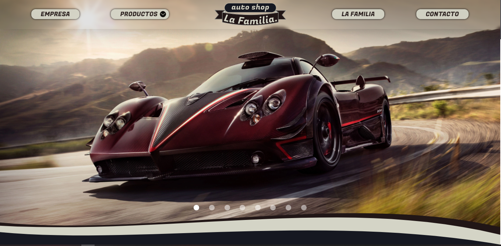
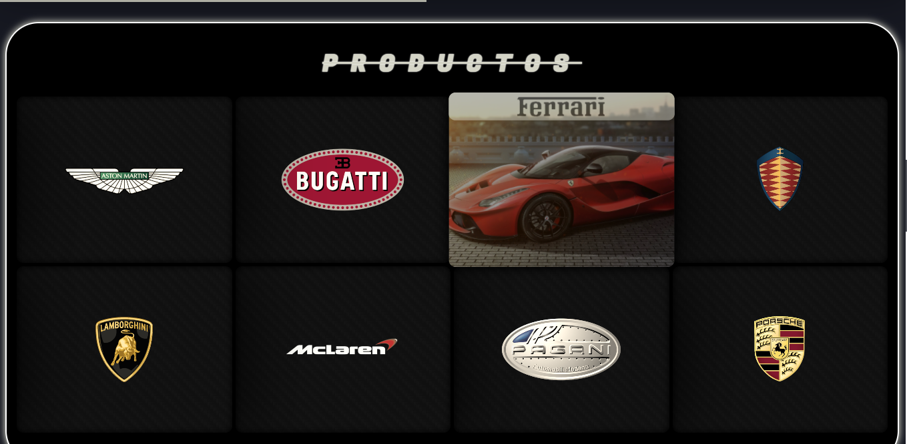
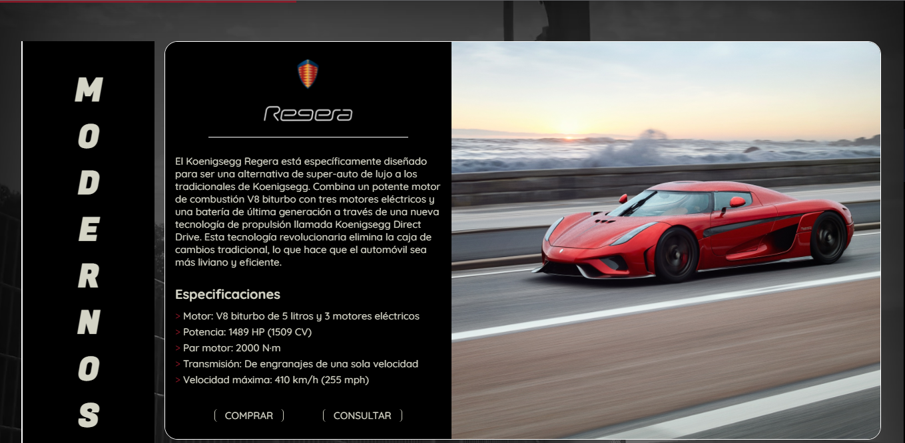
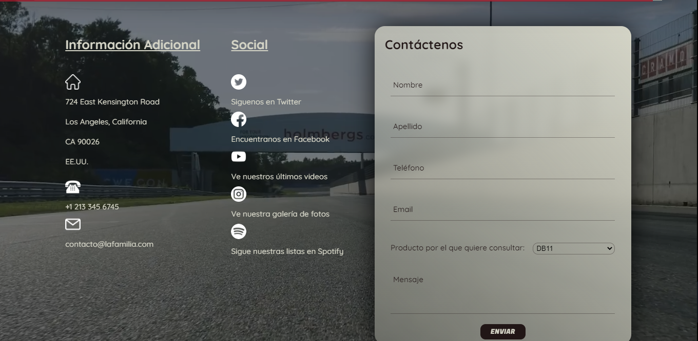

    
    

🚗 Sportcars dealership created with HTML, CSS and a bit of JavaScript for the CoderHouse FullStack Web Developer career.

[Live Demo](https://ferbuono.github.io/la-familia-auto-shop/)

## Table of Contents

* [Project overview](#project-overview)

* [Screenshots](#screenshots)

* [Technologies](#technologies)

## Project overview

My very first project, created for the Web Developer course of the CouderHouse's Full Stack Dev career.

The web is fully responsive. 

The pages were created with HTML, SASSS was used for pages styling and a minor code was created with JavaScirpt to give dynamism to the header.

Bootstrap was also implemented particularly for the main page carousel. 

	
## Screenshots

## Technologies

This project was created with:
* HTML
* SASS
* JavaScript
* Bootstrap
* Animate.css

